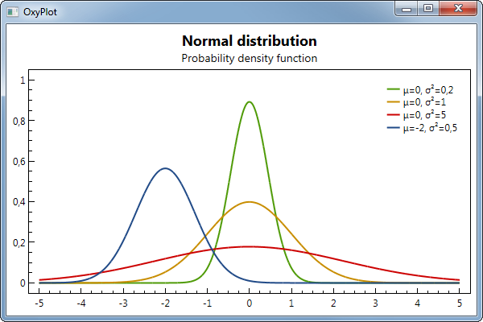

## oxyplot简介


[oxyplot](http://www.oxyplot.org/)是一个跨平台的作图库，其核心库可以移植到多种平台使用，定制化的控件可以在WPF, Windows 8, Windows Phone, Windows Phone Silverlight, Windows Forms, Silverlight, GTK#, Xwt, Xamarin.iOS, Xamarin.Android, Xamarin.Forms and Xamarin.Mac使用。[oxyplot文档](http://docs.oxyplot.org/en/latest/)目前还在建设，在我使用中没有查阅到有帮助的信息，只能从[oxylot的github](https://github.com/oxyplot/oxyplot)上clone，然后学习**Source/Examples**给的实例。

## oxplot安装和添加控件

因为oxyplot的文档资源还在建设中，所以并没有给出如何在vstudio的toolbox中添加控件的方法。我又去查阅了其他.net下的graphics库，发现了[liveCharts](https://lvcharts.net/App/examples/v1/wf/Install)库，其文档资源丰富，照其教程编译了一个example，感觉和winform的画风有差距，更偏向于heml的svg，但是，采用相同方法将oxyplot的control成功添加进了toolbox，猜想此方法具有通用性。
具体的：
1.新建一个项目

2.在解决方案窗口又击**引用**，选择**NuGet**（如果vstudio没有自带，需额外安装）

3.在NuGet中搜索oxplot,选择oxyplot.WinForm安装，安装成后，编译生成


4.调出toolbox工具栏，右击选择其他项，浏览文件夹到debug下，在生成文件文件中添加**oxyplot.WinForm.dll**，确定后会将oxyplot的**plotview**控件添加进入工具栏。

## winform简单的示例

根据github上的简单示例：

```csharp
namespace WindowsFormsDemo
{
    using System;
    using System.Drawing;
    using System.Windows.Forms;

    using OxyPlot;
    using OxyPlot.Series;

    public partial class Form1 : Form
    {
        public Form1()
        {
            InitializeComponent();
            var pm = new PlotModel
            {
                Title = "Trigonometric functions",
                Subtitle = "Example using the FunctionSeries",
                PlotType = PlotType.Cartesian,  // 定义plot类型为笛卡尔坐标系
                Background = OxyColors.White
            };
            pm.Series.Add(new FunctionSeries(Math.Sin, -10, 10, 0.1, "sin(x)")); //在PlotModel中添加数据点，数据点的产生方式为FunctionSerie函数
            pm.Series.Add(new FunctionSeries(Math.Cos, -10, 10, 0.1, "cos(x)"));
            pm.Series.Add(new FunctionSeries(t => 5 * Math.Cos(t), t => 5 * Math.Sin(t), 0, 2 * Math.PI, 0.1, "cos(t),sin(t)"));
            plot1.Model = pm;  //plot1为form中的oxyplot控件plotview的name,将生成的plotModel传递给plotview显示
        }
    }
}
```

其中，*FunctionSeries* 根据[oxyplot文档解释](http://docs.oxyplot.org/en/latest/models/series/#tracker)数据点的产生方式应该是通过**String.Format**方式，框架作者将其封装好，直接调用，例如我要用的*StairStepSeries*产生阶梯信号。

## 使用StairStepSeries产生阶梯曲线

在**oxyplot/Source/Examples/ExampleLibrary/Series/StairStepSeriesExamples.cs**中给出了[*StairStepSeries*](https://github.com/oxyplot/oxyplot/blob/develop/Source/Examples/ExampleLibrary/Series/StairStepSeriesExamples.cs)的示例

```csharp
// --------------------------------------------------------------------------------------------------------------------
// <copyright file="StairStepSeriesExamples.cs" company="OxyPlot">
//   Copyright (c) 2014 OxyPlot contributors
// </copyright>
// <summary>
//   Provides examples for the <see cref="StairStepSeries" />.
// </summary>
// --------------------------------------------------------------------------------------------------------------------

namespace ExampleLibrary
{
    using System;

    using OxyPlot;
    using OxyPlot.Series;

    /// <summary>
    /// Provides examples for the <see cref="StairStepSeries" />.
    /// </summary>
    [Examples("StairStepSeries"), Tags("Series")]
    public static class StairStepSeriesExamples
    {
        [Example("StairStepSeries")]
        public static PlotModel StairStepSeries()
        {
            return CreateExampleModel(new StairStepSeries());
        }

        [Example("StairStepSeries with labels")]
        public static PlotModel StairStepSeriesWithLabels()
        {
            return CreateExampleModel(new StairStepSeries { LabelFormatString = "{1:0.00}" });
        }

        [Example("StairStepSeries with markers")]
        public static PlotModel StairStepSeriesWithMarkers()
        {
            return CreateExampleModel(new StairStepSeries
                         {
                             Color = OxyColors.SkyBlue,
                             MarkerType = MarkerType.Circle,
                             MarkerSize = 6,
                             MarkerStroke = OxyColors.White,
                             MarkerFill = OxyColors.SkyBlue,
                             MarkerStrokeThickness = 1.5
                         });
        }

        [Example("StairStepSeries with thin vertical lines")]
        public static PlotModel StairStepSeriesThinVertical()
        {
            return CreateExampleModel(new StairStepSeries
            {
                StrokeThickness = 3,
                VerticalStrokeThickness = 0.4,
                MarkerType = MarkerType.None
            });
        }

        [Example("StairStepSeries with dashed vertical lines")]
        public static PlotModel StairStepSeriesDashedVertical()
        {
            return CreateExampleModel(new StairStepSeries
            {
                VerticalLineStyle = LineStyle.Dash,
                MarkerType = MarkerType.None
            });
        }

        /// <summary>
        /// Creates an example model and fills the specified series with points.
        /// </summary>
        /// <param name="series">The series.</param>
        /// <returns>A plot model.</returns>
        private static PlotModel CreateExampleModel(DataPointSeries series)
        {
            var model = new PlotModel { Title = "StairStepSeries", LegendSymbolLength = 24 };
            series.Title = "sin(x)";
            for (double x = 0; x < Math.PI * 2; x += 0.5)
            {
                series.Points.Add(new DataPoint(x, Math.Sin(x)));
            }

            model.Series.Add(series);
            return model;
        }
    }
}
```

重点看到最后*CreateExampleModel*，其中*series*其实为

```csharp
var series = new StairStepseries;
```

向*StairStepseries*中添加数据点

```csharp
series.Points.Add(new DataPoint（x, Math.Sin(x));
```

最后将添加完成的*StairStepseries*曲线，加入*PlotModel*

```csharp
plotModel.Series.Add(stairStepseries)
```
